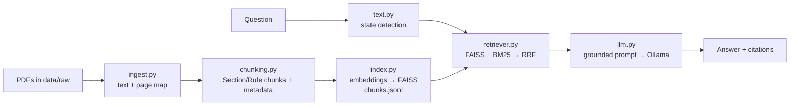

# ⚖️ ChallanSaathi — Indian Motor Vehicle Law Assistant

ChallanSaathi answers questions about Indian motor vehicle law — in English, Hindi or Hinglish —
using **hybrid retrieval-augmented generation (RAG)**. It finds the relevant Sections and Rules in
the official legal texts with **vector search + BM25**, then a local LLM (via **Ollama**) explains
them in plain language with **citations down to the page**.

> ⚠️ ChallanSaathi provides general information, **not legal advice**. Laws are amended often;
> always check the official text.

---

## ✨ Features

- **Structure-aware chunking** — documents are split at real Section/Rule boundaries (e.g.
  `185. Driving by a drunken person.—`), not at arbitrary character counts. Tables of contents,
  footnotes and numbered lists are filtered out, and inserted provisions like `2A`/`163B` are kept.
- **Rich metadata** — every chunk knows its document, state, Section/Rule number, heading,
  chapter and page range, so answers cite `Motor Vehicles Act, 1988, Section 185 (p. 89)`.
- **Hybrid retrieval** — multilingual sentence embeddings (FAISS, cosine similarity) fused with
  BM25 keyword search using weighted Reciprocal Rank Fusion.
- **State-aware search** — "Haryana mein…" or "UP mein…" searches that state's rules **plus**
  central law, never another state's rules.
- **Hinglish support** — multilingual embeddings and a Hinglish stop-word list for BM25.
- **Grounded answers** — the LLM is instructed to answer only from numbered sources and cite them.
- **Persistent index** — built once, loaded in seconds; rebuild is flagged when PDFs change.
- **Streamlit chat UI**, a **CLI**, tests and CI.

## 🏗️ Architecture



## 📚 Documents

| File | Document | Scope |
|------|----------|-------|
| `MOTOR_VEHICLES.pdf` | Motor Vehicles Act, 1988 | Central |
| `CMVR.pdf` | Central Motor Vehicles Rules, 1989 | Central |
| `HARYANA.pdf` | Haryana Motor Vehicles Rules, 1993 | Haryana |
| `UP.pdf` | Uttar Pradesh Motor Vehicles Rules, 1998 | Uttar Pradesh |

To add a document, drop the PDF into `data/raw/`, register it in
[`src/challansaathi/sources.py`](src/challansaathi/sources.py) and rebuild the index.

## 🚀 Quick start

Requirements: Python 3.10+ and [Ollama](https://ollama.com).

```bash
# 1. Install
make install                 # creates .venv and installs the package with app + dev extras

# 2. Get a local LLM
ollama pull llama3.2         # any Ollama chat model works; see "Configuration"

# 3. Build the search index (once, ~1 minute)
make index

# 4. Run the chat app
make app                     # opens http://localhost:8501
```

### CLI

```bash
challansaathi search "Haryana mein seating capacity ka rule kya hai?"   # retrieval only
challansaathi ask "What is the penalty for drunk driving?"
challansaathi ask "helmet rules" --state "Uttar Pradesh"
```

Example retrieval output:

```text
State filter: Haryana

[1] Haryana Motor Vehicles Rules, 1993, Rule 138 (pp. 49-50) — Limit of seating capacity. [Section 111(2)(a)]
[2] Haryana Motor Vehicles Rules, 1993, Rule 135 (p. 48) — Seating space. [Section 111(2)(a)]
[3] Haryana Motor Vehicles Rules, 1993, Rule 63 (p. 21) — Limitation of capacity of stage carriages and contract carriages.
```

### Python

```python
from challansaathi.pipeline import ChallanSaathi

assistant = ChallanSaathi()
answer = assistant.ask("UP mein helmet na pehnne par kya hoga?")
print(answer.text())
for source in answer.sources:
    print(source.chunk.citation)
```

## ⚙️ Configuration

Set environment variables (see [`.env.example`](.env.example)):

| Variable | Default |
|----------|---------|
| `CHALLANSAATHI_OLLAMA_MODEL` | `llama3.2` |
| `CHALLANSAATHI_OLLAMA_HOST` | `http://localhost:11434` |
| `CHALLANSAATHI_EMBEDDING_MODEL` | `sentence-transformers/paraphrase-multilingual-MiniLM-L12-v2` |
| `CHALLANSAATHI_DATA_DIR` | `data/raw` |
| `CHALLANSAATHI_INDEX_DIR` | `vectorstore` |

Retrieval parameters (top-k, fusion weights, chunk size) live in
[`src/challansaathi/config.py`](src/challansaathi/config.py).

## 📂 Project structure

```text
ChallanSaathi/
├── app/streamlit_app.py        # chat UI
├── data/raw/                   # source PDFs
├── notebooks/exploration.ipynb # original prototyping notebook
├── src/challansaathi/
│   ├── config.py               # settings
│   ├── sources.py              # document registry (title, state, Section vs Rule)
│   ├── ingest.py               # PDF → text + page map
│   ├── chunking.py             # Section/Rule-aware chunking
│   ├── index.py                # build / save / load FAISS index
│   ├── text.py                 # tokenizer, Hinglish stop words, state detection
│   ├── retriever.py            # hybrid search + RRF
│   ├── llm.py                  # prompt + Ollama client
│   ├── pipeline.py             # ChallanSaathi.ask()
│   └── cli.py                  # `challansaathi` command
├── tests/                      # pytest suite (no model download needed)
├── vectorstore/                # generated index (git-ignored)
├── Makefile
└── pyproject.toml
```

## 🧪 Development

```bash
make test     # pytest
make lint     # ruff check + format check
make format   # auto-fix
```

CI runs lint and tests on every push and pull request.

## 🗺️ Roadmap

- [ ] Retrieval evaluation set (hit rate / MRR: vector vs BM25 vs hybrid)
- [ ] Cross-encoder reranking
- [ ] Challan fine calculator for common offences
- [ ] More states
- [ ] Docker image with Ollama
