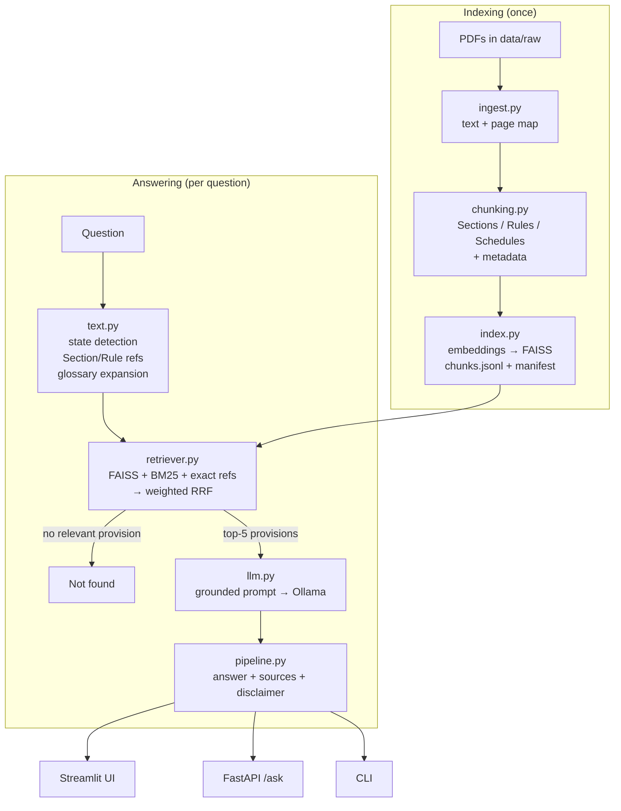

# ⚖️ ChallanSaathi — Indian Motor Vehicle Law Assistant

ChallanSaathi answers questions about Indian motor vehicle law in English, Hindi or Hinglish.
It retrieves the relevant **Sections and Rules** from the official legal texts with **hybrid
search** (multilingual embeddings + BM25), and a **local LLM running in Ollama** explains them
in plain language, citing every source down to the page. Nothing leaves your machine.

---

## 🎯 The problem

Traffic law in India is spread over a central Act, central Rules and separate Rules for every
State, written in dense legal English. A driver who wants to know "UP mein driver badge kaise
milta hai?" has to know which document, which Rule and which State applies. General chatbots
answer confidently but often invent section numbers and fines.

ChallanSaathi answers **only from the retrieved legal text**, shows exactly which provisions it
used, and says so when the documents don't cover a question.

## ✨ Features

- **Structure-aware ingestion.** Documents are split at real Section/Rule boundaries
  (`185. Driving by a drunken person.—`), not at arbitrary character counts. Headings are chosen
  as the longest consistent numbering sequence, which filters out tables of contents, footnotes,
  sub-rules and cross-references while keeping inserted provisions such as `2A` and `163B`.
  Schedules and forms after the last rule (e.g. `Form SR-2: Transport Vehicle Driver's Badge`)
  become their own chunks.
- **Rich metadata on every chunk**: document, jurisdiction (Central / Haryana / Uttar Pradesh),
  Section or Rule number, heading, chapter, page range and how current the text is.
- **Hybrid retrieval**: FAISS cosine search over multilingual embeddings + BM25, fused with
  weighted Reciprocal Rank Fusion (measured in "Retrieval evaluation" below).
- **Query understanding**:
  - automatic **state detection** ("Haryana mein…", "UP", "U.P.", "Uttar Pradesh");
  - explicit **Section/Rule lookup** ("Section 129", "rule 138", "dhara 185", "niyam 12");
  - a **statutory glossary** that maps everyday and Hinglish words to the words the law uses
    (helmet → protective headgear, daru → drunken, seat belt → safety belt);
  - Hinglish **stop-word removal** for BM25.
- **State-aware filtering**: a Haryana question searches Haryana rules **plus** central law,
  never another State's rules.
- **Out-of-scope detection**: questions unrelated to motor vehicle law ("best python web
  framework") get a "not found" answer without calling the LLM.
- **Grounded generation**: the prompt makes the model answer only from numbered sources, cite
  them as `[1]`, name the Section/Rule, separate Central and State law, and flag that fines may be
  out of date. A legal disclaimer is appended by code to every generated answer.
- **Persistent index**: built once and loaded in seconds. It is rebuilt automatically only when
  the PDFs or the embedding model change.
- **Three interfaces**: Streamlit chat UI, REST API (FastAPI) and CLI, all using the same pipeline.
- **Engineering**: automated tests (unit, API and integration tests against the real PDFs),
  ruff, pre-commit, GitHub Actions CI, and pinned dependencies.

## 🏗️ Architecture



## 🧰 Tech stack

| Layer | Tools |
|---|---|
| PDF parsing | pypdf |
| Embeddings | sentence-transformers, `paraphrase-multilingual-MiniLM-L12-v2` |
| Vector search | FAISS (`IndexFlatIP` on normalised vectors = cosine similarity) |
| Keyword search | rank-bm25 |
| LLM | Ollama (default `llama3.2`, 3B) |
| UI / API / CLI | Streamlit, FastAPI + Uvicorn, argparse |
| Quality | pytest, ruff, pre-commit, GitHub Actions |

## 📂 Repository structure

```text
ChallanSaathi/
├── app/streamlit_app.py        # chat UI
├── data/raw/                   # source PDFs (see "Data sources")
├── eval/
│   ├── questions.jsonl         # 48 questions with the expected Section/Rule
│   ├── run_eval.py             # Hit@1 / Hit@5 / MRR for each retrieval configuration
│   └── results.md              # latest results (generated)
├── notebooks/exploration.ipynb # original prototype, kept for reference
├── scripts/build_index.py      # build the index without the CLI entry point
├── src/challansaathi/
│   ├── config.py               # settings (env vars CHALLANSAATHI_*)
│   ├── sources.py              # document registry: title, jurisdiction, Section vs Rule, date
│   ├── ingest.py               # PDF → text + character-offset page map
│   ├── chunking.py             # heading detection, schedules, splitting, metadata
│   ├── index.py                # build / save / load (and rebuild-if-stale) the index
│   ├── text.py                 # tokenizer, state detection, references, glossary
│   ├── retriever.py            # hybrid search + RRF + grouping per provision
│   ├── llm.py                  # system prompt, context formatting, Ollama client
│   ├── pipeline.py             # ChallanSaathi.ask() → answer + sources
│   ├── api.py                  # FastAPI app
│   └── cli.py                  # `challansaathi` command
├── tests/                      # unit, API and real-PDF integration tests
├── vectorstore/                # generated index (git-ignored)
├── .env.example  .pre-commit-config.yaml  LICENSE  Makefile
├── pyproject.toml              # dependencies (compatible version ranges)
└── requirements.lock           # exact pinned versions
```

## 🚀 Installation

Requires Python 3.10+ (developed on 3.13) and about 3 GB of disk for the models.

```bash
git clone <this repo> && cd ChallanSaathi
make install          # creates .venv, installs app + API + dev extras, sets up pre-commit
```

For exactly reproducible versions: `pip install -r requirements.lock && pip install -e . --no-deps`.

### Ollama setup

```bash
brew install ollama          # macOS; Linux/Windows: see https://ollama.com/download
ollama serve                 # leave running (the desktop app starts it automatically)
ollama pull llama3.2         # ~2 GB, runs on 8 GB RAM
```

Any Ollama chat model works. Set `CHALLANSAATHI_OLLAMA_MODEL` to use another one, e.g. a larger
model if you have 16 GB RAM or more.

### Build the index

```bash
make index            # parse PDFs → chunk → embed → save to vectorstore/ (~1 minute)
```

The first run downloads the embedding model (~500 MB). If you skip this step, the app, API
and CLI build the index automatically on first start. After that they load it from disk and
rebuild only if a PDF or the embedding model changes.

## 💬 Running

### Streamlit UI

```bash
make app              # http://localhost:8501
```

Pick a jurisdiction or let it be detected, ask a question, and expand each source to see the
provision text, its chapter, pages and date.

### REST API

```bash
make api              # http://localhost:8000, interactive docs at /docs
```

```bash
curl -s -X POST localhost:8000/ask -H 'content-type: application/json' \
     -d '{"question": "What is the penalty for drunk driving?"}'
```

Response (abridged):

```json
{
  "question": "What is the penalty for drunk driving?",
  "state": null,
  "answer": "For the first offence, the penalty for drunk driving is imprisonment for a term which may extend to six months, or with fine which may extend to two thousand rupees, or with both [1]. ...",
  "sources": [
    {
      "source_id": 1,
      "citation": "Motor Vehicles Act, 1988, Section 185 (p. 89)",
      "title": "Motor Vehicles Act, 1988",
      "document": "MOTOR_VEHICLES.pdf",
      "jurisdiction": "Central",
      "unit": "Section",
      "number": "185",
      "heading": "Driving by a drunken person or by a person under the influence of drugs",
      "chapter": "CHAPTER XIII",
      "page_start": 89,
      "page_end": 89,
      "text_as_of": "Oct 2018 (before the Motor Vehicles (Amendment) Act, 2019)",
      "score": 0.01641,
      "excerpt": "185. Driving by a drunken person or by a person under the influence of drugs.—Whoever, ..."
    }
  ]
}
```

| Endpoint | Purpose |
|---|---|
| `POST /ask` | `{"question": str, "state"?: "Haryana" \| "Uttar Pradesh" \| "India"}` → answer + sources |
| `POST /search` | same body → sources only (no LLM call) |
| `GET /health` | status, indexed chunk count, LLM model |

`state` is optional (detected from the question); `"India"` means central law only. Invalid
input returns `422`. If Ollama is not reachable, `/ask` returns `503` with setup instructions.

### CLI

```bash
challansaathi search "Haryana mein bus ki seating capacity ka rule kya hai?"   # retrieval only
challansaathi ask "What does Section 129 of the Motor Vehicles Act say?"
challansaathi ask "helmet rules" --state "Uttar Pradesh"
```

### Python

```python
from challansaathi.pipeline import ChallanSaathi

result = ChallanSaathi().ask("UP mein driver badge kaise milta hai?").to_dict()
print(result["answer"])
for source in result["sources"]:
    print(source["citation"])
```

## 🙋 Example questions

Top two sources actually retrieved by the current index:

| Question | Retrieved |
|---|---|
| What is the penalty for drunk driving? | Act Section 185, Act Section 201 |
| daru pee ke gaadi chalane par kya saza hai? | Act Section 185, Act Section 204 |
| What does Section 129 of the Motor Vehicles Act say? | Act Section 129, Act Section 65 |
| Haryana mein bus ki seating capacity ka rule kya hai? | Haryana Rule 138, Haryana Rule 63 |
| UP mein transport vehicle ke driver ka badge kaise milta hai? | UP Rule 12, UP Form SR-2 |
| How do I transfer ownership of a vehicle? | CMVR Rule 55, Haryana Rule 48 |
| best python web framework | *nothing: out of scope, LLM not called* |

## 📊 Retrieval evaluation

[`eval/questions.jsonl`](eval/questions.jsonl) holds 48 realistic questions (34 English,
14 Hinglish), each labelled with the Section(s)/Rule(s) that answer it: 27 central law, 9
Haryana, 8 Uttar Pradesh and 4 spanning both. `make eval` runs every configuration against the
real index, with the same state detection as the app. A hit means one of the expected provisions
is among the returned provisions.

Latest run (1779 chunks, top-5):

| Configuration | Hit@1 | Hit@5 | MRR@5 |
|---|---|---|---|
| Vector only | 56.2% | 77.1% | 0.640 |
| BM25 only | 45.8% | 70.8% | 0.557 |
| BM25 only + query expansion | 56.2% | 81.2% | 0.654 |
| Hybrid (RRF) | 62.5% | 77.1% | 0.698 |
| Hybrid + expansion (BM25 side) | 66.7% | 81.2% | 0.740 |
| **Hybrid + expansion (both sides)** (default) | **66.7%** | **87.5%** | **0.766** |

What this shows:

- **Hybrid beats either retriever alone** (MRR 0.698 vs 0.640 for vector and 0.557 for BM25).
  Only the hybrid configurations use explicit "Section 129" / "rule 138" matching, which is
  part of their advantage.
- **The statutory glossary helps both BM25 and hybrid** (hybrid MRR 0.698 → 0.766, Hit@5
  77.1% → 87.5%).
- **Hinglish is the weak spot.** The default was chosen on the first 40 questions; the last 8
  (all Hinglish) were added afterwards, without further tuning. It finds the right provision for
  5 of those 8.
- The remaining misses are vocabulary gaps between everyday words and statutory wording, e.g.
  "drive without a licence" vs Section 3 *Necessity for driving licence*, "licence phat gaya" vs
  UP Rule 9 *defaced or torn*, "umar" vs Section 4 *Age limit*.

Caveats: 48 questions is a small set, and these numbers measure retrieval only, not the quality
of the generated answers.

## 📚 Data sources

| File | Document | Jurisdiction | Text current to |
|---|---|---|---|
| `MOTOR_VEHICLES.pdf` | Motor Vehicles Act, 1988 (India Code) | Central | Oct 2018 |
| `CMVR.pdf` | Central Motor Vehicles Rules, 1989 | Central | 2008 |
| `HARYANA.pdf` | Haryana Motor Vehicles Rules, 1993 | Haryana | 2021 |
| `UP.pdf` | Uttar Pradesh Motor Vehicle Rules, 1998 (as amended) | Uttar Pradesh | 2023 |

Dates come from the PDF metadata and the latest amendment years mentioned in each text. To add
a document, put the PDF in `data/raw/`, add it to `REGISTRY` in
[`sources.py`](src/challansaathi/sources.py) and run `make index`.

## ⚙️ Configuration

Environment variables (see [`.env.example`](.env.example)):

| Variable | Default |
|---|---|
| `CHALLANSAATHI_OLLAMA_MODEL` | `llama3.2` |
| `CHALLANSAATHI_OLLAMA_HOST` | `http://localhost:11434` |
| `CHALLANSAATHI_EMBEDDING_MODEL` | `sentence-transformers/paraphrase-multilingual-MiniLM-L12-v2` |
| `CHALLANSAATHI_DATA_DIR` | `data/raw` |
| `CHALLANSAATHI_INDEX_DIR` | `vectorstore` |

Retrieval parameters (top-k, fusion weights, relevance cut-off, query expansion, chunk size)
are in [`config.py`](src/challansaathi/config.py).

## 🧪 Development

```bash
make test     # unit, API (FastAPI TestClient), real-PDF integration tests and doctests
make lint     # ruff check + ruff format --check
make format   # auto-fix
make eval     # retrieval evaluation → eval/results.md
make lock     # regenerate requirements.lock
```

Unit tests use a small deterministic fake embedder and a fake LLM, so they run in seconds
without downloading models. CI runs lint and tests on every push and pull request.

## ⚠️ Limitations

- **Outdated fines.** The Motor Vehicles Act PDF is the October 2018 text. The Motor Vehicles
  (Amendment) Act, 2019 raised most penalties and added Sections such as 194B (seat belts) and
  194D (helmets), which are **not** in this corpus. CMVR is the 2008 text. The app warns about
  this and answers mention the text's date, but for current fine amounts use the latest official
  texts from [India Code](https://www.indiacode.nic.in).
- **Small local model.** `llama3.2` (3B) runs on a laptop, but its Hinglish can be awkward, and it
  sometimes skips `[n]` citations or garbles formulas (e.g. the Haryana seating-capacity rule).
  A larger Ollama model gives better answers. Same-size `qwen2.5:3b` was tried as an
  alternative: it followed the sources more closely on one question but produced garbled Hindi
  and an invented rule number on another, so `llama3.2` stays the default.
- **Hinglish retrieval** is weaker than English (see the evaluation).
- **PDF text quality.** Extracted text contains artefacts ("provis ion", "abetmen t") and page
  footers, and tables in schedules are flattened.
- **Coverage.** Only central law, Haryana and Uttar Pradesh. Other States' rules are not included.
- **Out-of-scope detection** is a similarity threshold. Legal-but-unrelated questions (e.g.
  divorce) pass it, and the LLM is then instructed to say the documents don't cover them.

## 📄 License

Code: [MIT](LICENSE). The legal texts in `data/raw` are Government of India / State Government
publications and are not covered by the MIT license.
